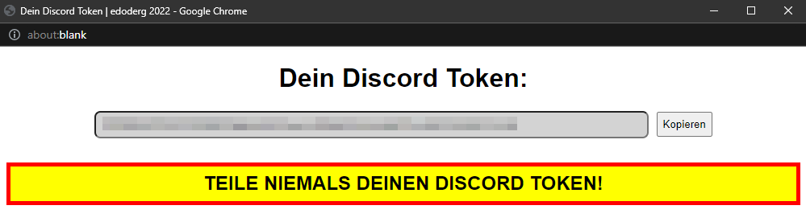

# discordTokenEdo v1.2
###### [ENG] Press a key combination ( ALT + G ) to display your Discord token. Requirement: Be logged in on [Discord](https://discord.com/login)
###### [GER] Lässt mit einer Tastenkombination ( ALT + G ) deinen Discord Token anzeigen. Bedingung: Eingeloggt sein auf [Discord](https://discord.com/login)

## [ENGLISH]

#### Lets u display your discord token and copy it easily with a key combination.

### Installing Proccess

**Step 1.** Install one of the browser extensions:

_Tampermonkey:_ _[Chrome](https://chrome.google.com/webstore/detail/tampermonkey/dhdgffkkebhmkfjojejmpbldmpobfkfo),_
              _[Firefox](https://addons.mozilla.org/en-US/firefox/addon/tampermonkey/)_
              
_Violentmonkey:_ _[Chrome](https://chrome.google.com/webstore/detail/violentmonkey/jinjaccalgkegednnccohejagnlnfdag),_
               _[Firefox](https://addons.mozilla.org/en-US/firefox/addon/violentmonkey/),_ 
               _[Maxthon](https://extension.maxthon.com/detail/index.php?view_id=1680)_
              
_Greasemonkey: [Firefox](https://addons.mozilla.org/en-US/firefox/addon/greasemonkey/)_

**Step 2.** Download the plugin [Here](https://edoderg.github.io/discordTokenEdo/discordTokenEdo.user.js) → **WHEN ON WEBSITE:** **<ins>CTRL + S</ins>** 🚩

**Step 3.** Confirm the installation of the script.

## View when pressing *ALT + G*:

 

## [GERMAN]

#### Ermöglicht das einfache Kopieren und Anzeigen von deinem Discord Token mit einer Tastenkombination.

### Installieren

**Schritt 1.** Installier einer der Browser Erweiterungen:

_Tampermonkey:_ _[Chrome](https://chrome.google.com/webstore/detail/tampermonkey/dhdgffkkebhmkfjojejmpbldmpobfkfo),_ 
              _[Firefox](https://addons.mozilla.org/en-US/firefox/addon/tampermonkey/)_
              
_Violentmonkey:_ _[Chrome](https://chrome.google.com/webstore/detail/violentmonkey/jinjaccalgkegednnccohejagnlnfdag),_ 
               _[Firefox](https://addons.mozilla.org/en-US/firefox/addon/violentmonkey/),_ 
               _[Maxthon](https://extension.maxthon.com/detail/index.php?view_id=1680)_
              
_Greasemonkey:_ _[Firefox](https://addons.mozilla.org/en-US/firefox/addon/greasemonkey/)_

**Schritt 2.** Lade das Plugin herunter [Hier](https://edoderg.github.io/discordTokenEdo/discordTokenEdo.user.js) → **WENN AUF WEBSEITE:** **<ins>STRG + S</ins>** 🚩

**Schritt 3.** Bestätige die Installation vom Script.

## Ansicht wenn man *ALT + G* drückt:

 

# LEAVE A ⭐ THANK YOU

## Userscript made by:

    

 
